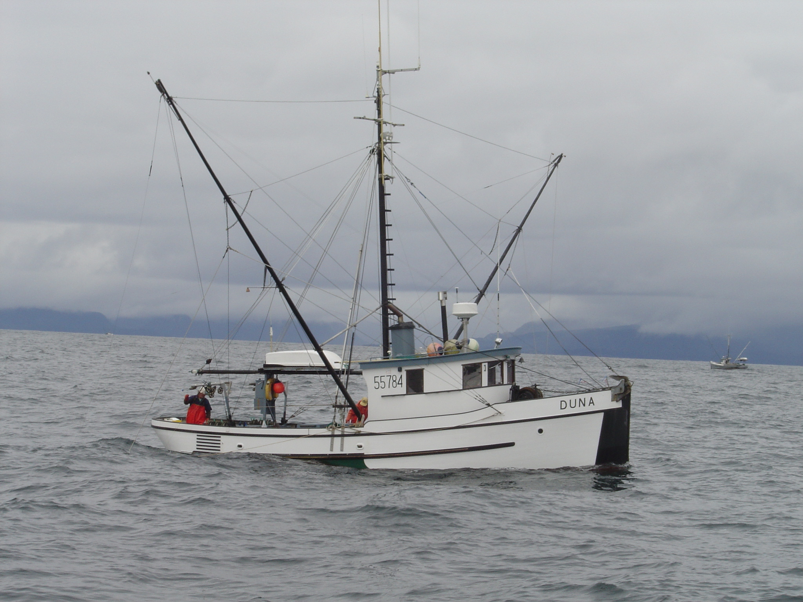

# F/V Duna

The ***Duna***, a 40-ft salmon troller, was built in 1936 in Tacoma, Washington.  Walt Sonen and Stchiko Scott bought her in 1982 and owned her until 2017.  They said "Our fishery is restricted by regulation to the eastern part of the Gulf of Alaska and Southeast Alaska,  Consequently, we have the distinction of being the most westerly based troller in North America.  We conduct our fishery on the open ocean during the summer months, fishing largely for king and coho salmon and we may trail as many as 72 individual lures at one time.   The Duna is a crew of two.  We base ourselves in Yakatat but may range as far as Sitka. - Walt Sonen, Captain

Greg and Amy Grondin bought the ***Duna*** from Walt and Sachiko and continued to fish in Washington and Alaska until 2019. Their salmon fishing season "begins off the coast of Washington on May 1st. Towards the end of June we’ll stop fishing Washington waters and start the trip to Southeast Alaska where they fish for the rest of the summer."

In 2020 F/V Duna is based in Sitka and is owned and operated by Lance Preston, who serves on the board of directors for Seafood Producer's Cooperative.

