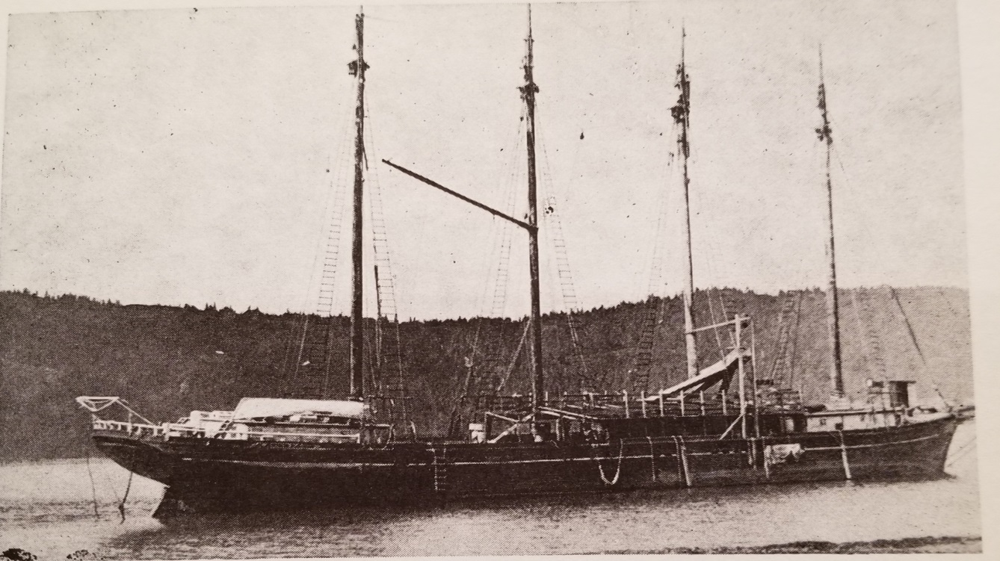

# THE SALVATOR

The Salvator, a four-masted, 160 foot schooner of 467 tons and 550 M
capacity, was built at Eureka in 1890 for C. A. Hooper, San Francisco.
She was named for J. B. Haggin's great race horse.

Later owned by the Pacific Shipping Co., the schooner was sold in 1912
to Libby, McNeil & Libby and operated out of Seattle as a salmon packer.

In 1931 she was sold to Axel Anderson and Peter Belmont of Seldovia and
was converted into a one-line floating cannery. It was stripped of all
unnecessary gear and masts and rearranged to accommodate canning
machinery.

The Salvator was stranded and lost in Seldovia Bay in 1935. It had
operated as a fishing and salmon packing vessel with 8 crewmen out of
Seward and Seldovia.

The 467 ton 160 foot four-masted schooner ***Salvator*** was stranded
and was lost in Seldovia Bay in 1935.  The ***Salvator*** operated as a
fishing and salmon packing vessel with 8 crewmen out of Seward and
Seldovia.

**Information:** Tonnage 467 Gross 385 Net, Length 160, Breadth 36,
Depth 11, Built 1890 at Eureka CA, SL KNXL, Owner Axel Anderson of
Seldovia, Registered Seward, ON 116364

\*\* Sources:\*\*

***1.*** Shipwrecks of the Alaskan Shelf and Shore *(1992),*

***2.*** Merchant Vessels of the U S *(1934) Pgs 656-7*

*3. The Marine Digest. August 16, 1941, p. 2*

*4. Fairbanks News Miner September 13, 1930*

Fairbanks News Miner September 13, 1930: WILL CONVERT SCHOONER INTO
FLOATING CANNERY

 Axel Anderson and Peter
Belmont of Seldovia have purchased the schooner Salvatore from Libby,
McNeil and Libby and plan to convert it into a one-line floating
cannery. It will be stripped of all unnecessary gear and masts and
rearranged to accommodate canning machinery. They expect to have C.the
boat in operation for next season’s operations.

In 1905 the C.A. Hooper & Co. Pacific Shipping Company decided to
convert its fleet of 8 vessels to auxillary powered schooners with twin
Screw gas engines.

C.A. Hooper

Charles A. Hooper, born in Bangor, Maine, in 1843, came to California in
1863 to join his father, John Hooper, at a gold mine in Plymouth. In
1865, Charles went to San Francisco to establish the C.A. Hooper &
Company, supplying lumber to the growing city and surrounding region. He
built up a large lumbering business and eventually became known as the
"Lumber King of California." He married Ida Snow in 1880, and they made
their residence in Alameda, where they raised two daughters, Isobel and
Idolene. In 1900, he purchased the Los Medanos Rancho on the banks of
the San Joaquin River where the City of Pittsburg now stands in Contra
Costa County. Here he established a lumberyard and other businesses,
including a steel mill and rubber works. One of his ventures also
included the Diamond brick manufacturing plant in Pittsburg.

James Ben Ali Haggin, ca 1850-1920. Haggin (1822-1914) was once
considered to be among the three wealthiest men in America who made his
fortune in the mining industry (Comstock Lode, Homestake, Anaconda) with
Hearst and Tevis based out of Sacramento and San Francisco. His
connections were extensive in the horse racing realm, owning several
prominent and world champion racers, both in California and Kentucky. He
had mansions in California, Kentucky, Rhode Island, and New York City.

Haggin's world famous racing horse, Salvator, dated 1890, who set the
world’s record at the time in his set distance; original printed poem by
Ella Wheeler Wilcox entitled, "How Salvator Won"; and a photograph of a
cartoon image of W.C. Whitney and J.B. Haggin scheming about horse
rearing in Kentucky.

**Salvator** (1886–1909) was an
[American](https://en.wikipedia.org/wiki/United_States)
[thoroughbred](https://en.wikipedia.org/wiki/Thoroughbred) [race
horse](https://en.wikipedia.org/wiki/Race_horse) considered by many to
be one of the best racers during the latter half of the 19th century.

Bred by Daniel Swigert and foaled at his Elmendorf Stud April 30, 1886,
Salvator was a splendid animal and sold for $4,500 as a yearling to
James Ben Ali Haggin, one of the wealthiest men in America. A big,
handsome chestnut with a blaze and four white stockings, the colt was
originally named "Effendi," but was later renamed Salvator, after
Haggin’s valet.

**Carl Gosta Lindstedt** came to Seldovia in the mid-1920's at the age
of 19. He arrived from Seattle on the 4-masted schooner Alice Cook. He
remembered 52 seine boats tied up at the saltry where he worked and 4-5
thousand people flowing into town during summer herring run. The herring
saltry was a floating processor in Seldovia Bay called the Salvator. It
was actually an old 4-masted schooner owned by Libby, McNeil and Libby
and had been retrofitted from a sailing ship to a herring saltry.
Mr. Lindstedt earned $80/month with fifty cents an hour overtime and
room and board as well. These were considered big wages.

### Background

Bred by [\[Daniel
Swigert\]](https://en.wikipedia.org/w/index.php?title=Daniel_Swigert&action=edit&redlink=1)
of [\[Elmendorf Farm\]](https://en.wikipedia.org/wiki/Elmendorf_Farm) in
[\[Lexington,
Kentucky\]](https://en.wikipedia.org/wiki/Lexington,_Kentucky), Salvator
was sired by Prince Charlie out of Salina (by
[Lexington](https://en.wikipedia.org/wiki/Lexington_\(horse\))).
(Salvator was the last great horse Swigart bred; his best stallions had
grown old and died.) On his sire's side, he went back to the tremendous
mare [Pocahontas](https://en.wikipedia.org/wiki/Pocahontas_\(horse\)) by
[Glencoe](https://en.wikipedia.org/wiki/Glencoe_I). On his dam's side,
through Lexington, he carried the blood of
[Boston](https://en.wikipedia.org/wiki/Boston_\(horse\)) sired by
Timoleon sired by Sir Archie sired by
[Diomed](https://en.wikipedia.org/wiki/Diomed).

Unusual for the times, the dark chestnut with a large white blaze was
born in 1886 in [California](https://en.wikipedia.org/wiki/California).
[\[James Ben Ali
Haggin\]](https://en.wikipedia.org/wiki/James_Ben_Ali_Haggin) had
purchased his dam, Salina, and shipped her to his 44,000-acre
(180 km2) [\[Rancho Del
Paso\]](https://en.wikipedia.org/wiki/Rancho_Del_Paso) with Salvator *in
utero*. Haggin had made his money in the [\[California Gold
Rush\]](https://en.wikipedia.org/wiki/California_Gold_Rush) of 1849, so
much of it he was suddenly one of the wealthiest men in
[America](https://en.wikipedia.org/wiki/United_States), and he used his
new wealth to establish the biggest horse breeding operations in world
history. Aside from the thousands of grazing acres he owned in
[Arizona](https://en.wikipedia.org/wiki/Arizona), [\[New
Mexico\]](https://en.wikipedia.org/wiki/New_Mexico) and Southern
California, he headquartered at the Rancho del Paso near the present-day
city of [Sacramento](https://en.wikipedia.org/wiki/Sacramento). He
bought breeding horses from every state that bred fine thoroughbreds, as
well as shipping them in from
[Ireland](https://en.wikipedia.org/wiki/Ireland),
[Australia](https://en.wikipedia.org/wiki/Australia) and
[England](https://en.wikipedia.org/wiki/England). Eventually he bought
Swigert's Elmendorf Farm and moved his headquarters there. Haggin added
to the property until he held 8,700 acres (35 km2) of prime
bluegrass. (Over time, and through several owners, this property was
broken up into stud farms like [\[Spendthrift
Farm\]](https://en.wikipedia.org/wiki/Spendthrift_Farm), [\[Greentree
Stud\]](https://en.wikipedia.org/wiki/Greentree_Stable), and others.)

In the fall of 1887, Haggin's Eastern trainer, Matthew Byrnes, and
jockey [\[George "Snapper"
Garrison\]](https://en.wikipedia.org/w/index.php?title=George_%22Snapper%22_Garrison&action=edit&redlink=1)
arrived at the ranch to choose the best young horses to take back to
[\[New York\]](https://en.wikipedia.org/wiki/New_York_\(state\)).
Salvator was one of their choices.

At Monmouth Park, the [\[Grade
III\]](https://en.wikipedia.org/wiki/Graded_stakes_race) [\[Salvator
Mile Handicap\]](https://en.wikipedia.org/wiki/Salvator_Mile_Handicap)
will be in its 69th running in 2016.

Following the creation of the [\[National Museum of Racing and Hall of
Fame\]](https://en.wikipedia.org/wiki/National_Museum_of_Racing_and_Hall_of_Fame)
in 1955, Salvator was one of the horses inducted.

The race itself commemorates the great 19th century champion Salvator,
who set a world record (1:35 1/2) for a mile in a time trial, on the
straight mile course at old Monmouth Aug. 28, 1890. Hence the name of
the race, the "Salvator Mile."
