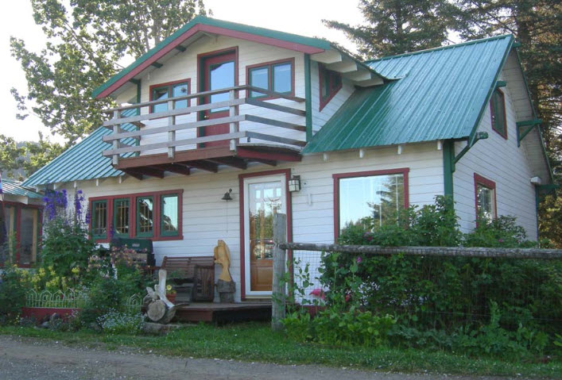

**Andreas Anderson** was born June 27, 1893 in Bergen, Norway.  He married Inga Johansen in Seldovia on October 3, 1919. 
They had two children, **Agnes** (1920-2000) and **Anthony "Tony"** (1929-1952).

In the 1930's, Andy built a house for Inga.  She was a short woman, and everything was built
the cupboards are low, the stove is low, he trimmed the legs on the stove 395 and built everything for her size
and then Agnes and Antone (Tony) were both big like Andy - Andy was a six footer - and they'd look so funny in that
house, because the cupboards were low and they were so 398 tall, but it fit her and he built the house for her.

