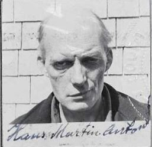

**HANS MARTIN ANTONSEN** was born in Green Island (Gronnoy), Norway June 24, 1895. He was the son of Anton Johansen, and sailed from Liverpool, England on the SS Adriatic, as a seaman, arriving in New York City on April 25, 1917. 

Hans came to Alaska in November 1931 and was living in Seldovia in 1940 where he worked as a cook for the cannery.  

He first declared his intention to become a US citizen in Anchorage courts became a US citizen in 1950. He never married.

He died, while in Anchorage, on September 9, 1965 and is buried in the Seldovia City Cemetery in Plot # 195.  

