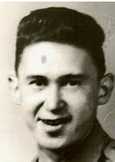

# Brun Family

The story of the **Brun** family in Alaska begins with the arrival of
Carl Johan Andreassen Brunstad who was born in Alesund, More og Romsdal,
Norway July 3, 1857. He came to the US in 1875 and shortened his name to
Carl Johan Brun. He married Martha "Mulluk Osbekoff. In 1910 Carl was
the Postmaster at Chignik. He was also a cook at a salmon cannery
there.They had eight children before Martha died in childbirth at the
age of 34 in 1939. Carl married second, Marcia. Carl died at Chignik on
September 15, 1939 at the age of 82.

# Mervin Howard Brun

**November 16, 1921, Chignik, Alaska -- February 9, Seldovia,
Alaska**{width="0.5430555555555555in"
height="0.8423611111111111in"}

**Mervin Brun** was born Nov. 16, 1921, in Chignik. As a
child, he attended school from April to September. Many times his was
one of only two families to stay in Chignik the entire winter, while the
rest of the village left to hunt and trap. The Aleut village of
Perryville formed a cooperative to stock and farm blue fox on Chiachi
Island and for a period of time, he lived on the island with his father,
where they raised blue fox. In 1940 Mervin was living in Chignik with
his mother's family and working in the cannery. In 1941, he left Chignik
for Anchorage where he worked on the railroad during the World War II
era. He was married to Florence Nyman, Linda Thomason and Honeybee
Wallin and fathered five children. Throughout his life, he worked in
many fishing canneries in Port Lions, Ouzinkie, Old Harbor, Woody
Island, Kodiak and Seldovia. In several of the canneries, he worked his
way up to being superintendent. He also worked as a store manager in
Seldovia and Seward.

# Stella Alexandria BRUN Suydam

**April 30, 1923, Chignik, Alaska -- December 2, 1987, Seldovia,
Alaska**

**Stella Alexandria Brun** was the daughter of **[Carl and
Martha Brun,** born in Chignik April 30, 1923. She married
first **Edward Wallin** and had daughters **[Carol Eve
Wallin** and **honeybee Wallin.** Then she
married **[Floyd Lowell
Suydam](../Word_Documents/Suydam%20Family.docx)**
(1928-2002).

# Carol Eve WALLIN Kincaid

**December 24, 1940, Chignik, Alaska -- January 1, 1999, Hughes,
Oklahoma**

Carole Eve WALLIN Kincaid was the daughter of Edward Albert Wallin and
Stella Alexandria Brun.
