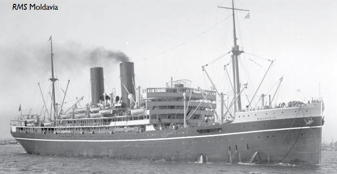

**FRANCIS LEE FAITH, "FRANK**, was born in Emison, Indiana on December 3, 1894 to **Charles
and Nora Faith**, of Irish descent. 

At the time he registered for the draft for WWI, he was 22 years old and still living in Indiana, working as a farm laborer.

On May 6, 1918 Frank was a private in Company A 58th Infantry, embarking to Europe on the USS Moldavia with 250 other soldiers from Brooklyn, NY. The Moldavia had earlier served on the Northern patrol as part of the 10th Cruiser Squadron, intercepting and examining merchant vessels in the North Atlantic.  It later served as a troopship and was carrying U.S. troops when she was sunk on 23 May 1918 off Beachy Head in the English Channel, by a single torpedo from the German Type UB III submarine SM UB-57. Her sinking resulted in the deaths of 55 U.S. soldiers.

 - The Moldavia was purchased by the British Admiralty in 1915 and converted into an armed merchant cruiser.  She was torpedoed and sunk on 23 May 1918 off Beachy Head in the English Channel, by a single torpedo from U-Boat UB-57.  At the time of her sinking she was being used as a troopship for United States troops from the 58th Infantry Regiment.  The following excerpt from the book **The Fourth Division: It’s Services and Achievements in the World War**
by Christian Albert Bach and Henry Nobel Hall
describes the Moldavia’s final moments:

 - *The first casualties in the (Fourth) Division, as the result of an enemy act, occurred at sea when the Moldavia, a refitted British liner with Companies “A” and “B” of the 58th Infantry on board, was torpedoed and sunk by a German submarine with the loss of 56 men, all but one being Company “B ” men. This occurred at 2:40 on the morning of May 23, 1918, at a point about midway between Land’s End and the Isle of Wight.*

 - *The Moldavia was armed with six light naval guns and two anti-aircraft guns. She was leading her convoy of five ships, “mothering” them, so to speak, while five British destroyers, which had joined them the previous day, darted around and between them. The sky was overcast with clouds and the night was very dark—ordinarily an ideal condition for outwitting the lurking U-boats. A sudden rift in the clouds permitted the moon to peep out for perhaps five minutes during which short time the invisible periscope enabled the U-boat commander to glimpse his prey and send the fatal torpedo crashing into her.*

 - *The explosion tore a gaping hole in the port side of the hull and shattered the compartment where the “B” Company men were sleeping and the ladders leading to the deck above. Nearly all the men in the compartment were killed outright by the explosion. The listing of the ship to port undoubtedly saved those who survived the explosion, enabling them to utilize the uneven surface of the sloping compartment walls in climbing to the next deck above, and from there to the boat deck and rescue.*

 - *Fortunately, the engines were not injured by the explosion, and the bursting of a starboard bulkhead caused the ship to resume an even keel. An attempt was made to reach shore, but the water gained rapidly and stilled the ship’s throbbing engines within an hour.  The explosion had awakened all on board.  Contrary to orders, many of the men had undressed before going to bed in the belief that the submarine danger was practically over, as land had been visible during the entire day.  In the darkness and confusion many of them were unable to find their clothes and were forced to go to their boat stations in little more than their underwear—some wore even less.*

  - *The dying down of the engines found nearly all the men at their proper boat stations. A decided list to starboard had developed, however, which made the launching of the boats at the port side a very precarious matter.  A number of men received a chilly bath during the process, but, eventually, the boats were launched.  One of the British destroyers came alongside, and made fast to the starboard side of the Moldavia, taking all the men she could find room for direct from one ship to the other.  Another destroyer circled around, picking up those who were in boats and hanging to the life-rafts.*

- *Only two men were lost by drowning, although many unwelcome cold baths were taken by those who tried to climb upon the life-rafts only to overbalance the unwieldy affairs and slide, headlong, back into the sea.  One soldier performed this stunt three times before he became convinced of the error of his ways.*

- *After dropping depth bombs over the area in which the Moldavia was struck, three of the destroyer escort and the other five ships of the convoy had scurried away to avoid possibility of further disaster.  This left only the two rescuing destroyers with their shivering but thankful burden, to watch the death throes of the stricken vessel.  She had settled forward rapidly, her stern slowly rising higher and higher in the air.*

 - *Picture, if you will, a glassy, calm sea in the early dawn of that season of the year; a heavily clouded sky through which the sun had not yet made its way, but light enough to make each detail of the tragedy visible to the spectators aboard the little rescue ships; abandoned life boats and rafts bobbing about; here and there a dead body; on the decks of the two waiting destroyers a motley, shivering, awestruck crowd in various stages of dress and undress; a long minute of breathless silence; a lurch; a gurgle; a ponderous gathering of that immense mass of steel, as if for physical effort, followed by the rearing of the stern high in the air; a sickening dive; a seething cauldron in which are tossed bits of wooden wreckage, and the Moldavia was no more.  The rescued soldiers, packed on the two destroyers, greeted the final plunge of their ship with a tumult of cheers.  END OF EXCERPT*

 - *The headlines of this event were downplayed in the U.S.; although it was a larger news story in the U.K.  A number of factors contributed to this.  First, it occurred during a busy news cycle.  Second, we could assume the U.S. War Department was reluctant to give any unnecessary information to the public, for the enemy to consume.  Third, editors simply decided that it was a British ship that went down during war time, not an American vessel; and they gave the story less editorial weight.   Unfortunately, the American public had grown accustomed to steam liners sinking in the Atlantic.  In fact, the Titanic went down only 6 years prior to this.*

 - *More importantly, there was a strong anti-war/isolationist sentiment in the U.S.; and President Wilson had to work hard to win the public’s support, not only to enter the war, but to also stay involved.  Any news story of an allied loss, such as the Moldavia, was dampened.*

 - *Despite the fact that America had joined the war in earnest just the year before; the American public felt that the U.S. were there to wrap things up.  The Moldavia was a slap in the face of the public’s notion that the war should be coming to a quick end.  In fact, it would be another long six months before the Armistice would be signed.  Many of the war’s bloodiest days were still to come, and many more lives would be lost.*

 - The US War Department issued only this statement:  “Besides 53 American soldiers reported as lost on the Moldavia there were 427 other American soldiers on board, a total of 480.  The American units aboard were part of the 59th Infantry. All those reported lost were members of Company B.”

By 1920 Frank was back in Indiana working alongside his father in a glass factory
there. 

He travelled to Canada in 1928 to harvest in the fields, but in 1930 he was in Vincennes working as a molder in a sewer pipe factory. 

He was living in Seward, Alaska by 1940 and registered for the World War II draft there in 1942, at the age of 48 while working on the Alaska Line. 

He died in Seldovia August 5, 1959. He is buried in the Seldovia City Cemetery, Plot \#163.
