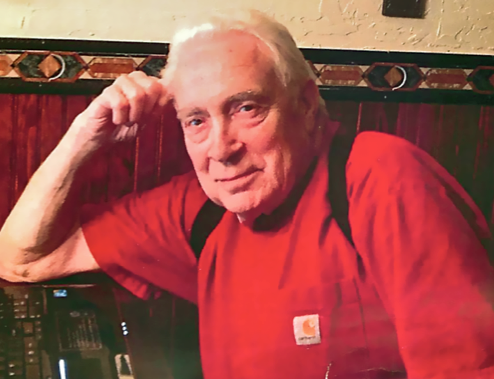
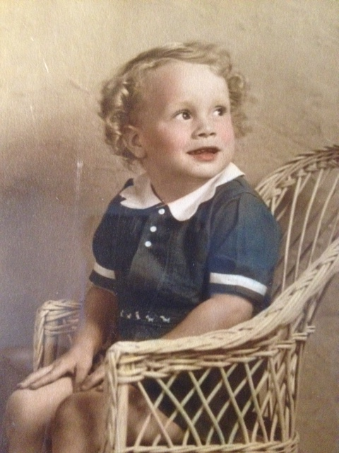
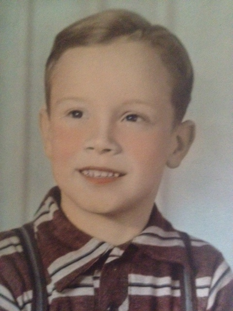
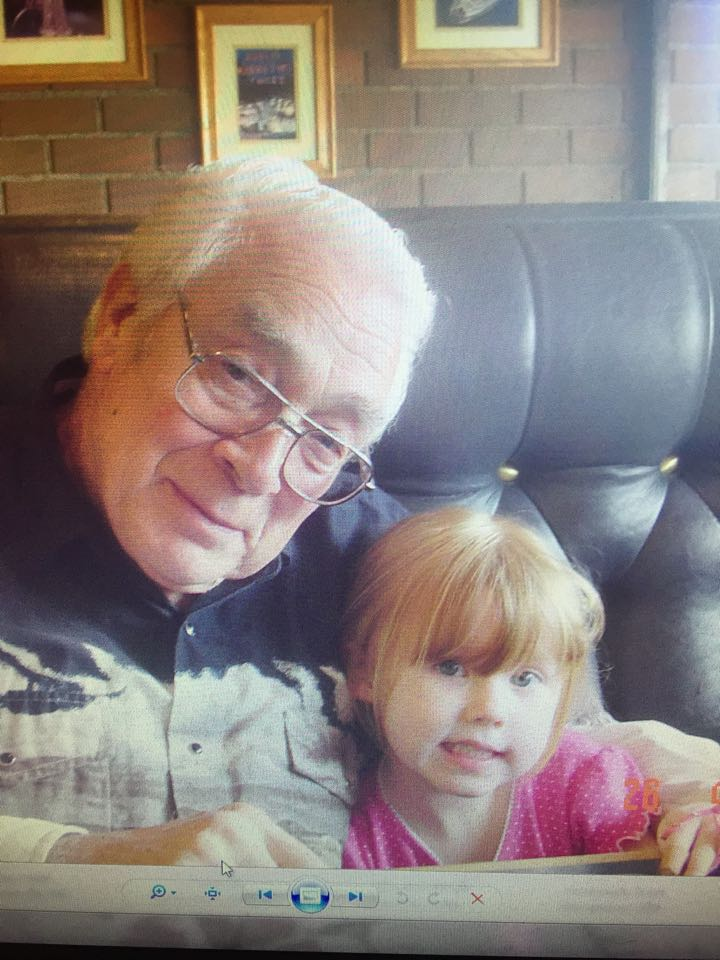

**GERALD PHILLIP HURLEY** was born on February 11, 1937 to Walter W and Elizabeth McConnell Hurley.   His parents owned the Bungalow on Orcas Island in the 1950's. 
He was married to Phyllis Kay Williams and had daughters Kathleen Louise and Christie Loraine Hurley. His daughter Christie preceded him in death in 1986. 

In 1975 he married **Shirley Negre Jones** and they had one son Sean Anders Hurley born in 1978. 

Gerald loved the outdoors and especially fishing. His life-long dream was to live in Alaska and they moved to Seldovia in 2006. His health declined the next several years and he died from a ruptured heart in Anchorage in 2013. He wished to be cremated and in November 2014 his ashes were spread in the Seldovia Slough where he wanted to be. He enjoyed writing his monthly letters about God's Gracious Character and published them on a website and mailed them to friends and relatives. Friends of Seldovia Bible Church and Seldovia Village Tribe assisted with his Memorial Service on May 12, 2014 in Seldovia.

