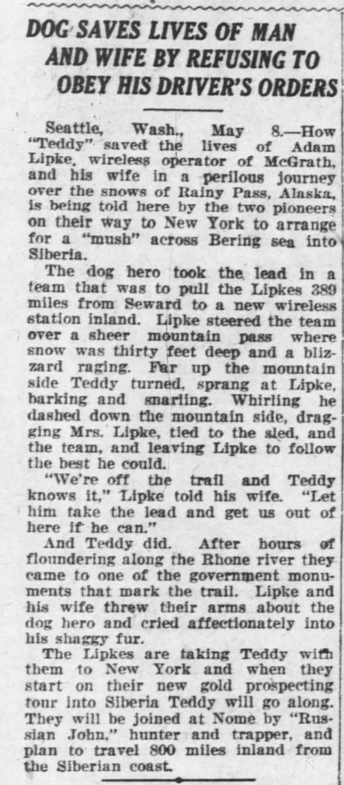

**ADAM WILLIAM LIPKE**, son of Frederick and Julia KOPATZ Lipka, was born in Buffalo, New York on November 20, 1893. His parents were both from Germany, and immigrated to the US in 1885, and soon after coming to the United States the surname was changed to Lipke. By 1900 the family was living in Washington State.

He married **Alice Poole** on December 29, 1916 in Alameda, California.  They were living in Seattle when Adam registered for the WWI draft, and he was already working as a radio operator for Alaska Steamship Company. In 1919 Adam filed for a Seaman’s Protection Certificate.

“A man and his wife were reunited in Philadelphia after a year’s separation through a wireless message consisting of a telephone number.  The message was sent by Mrs. Alice Lipke, a YWCA worker to her husband Adam Lipke, on board the steamer Pansa, about 150 miles from shore.  Lipke, who is a wireless operator on board, received the number, “Spruce 3317” and when the vessel docked at Port Richmond, he called the number and was answered by his wife, who is residing at No. 102 Arch Street.  Lipke has just returned from Calcutta, India, following a trip around the world, and last heard from his wife when she sailed from Seward, Alaska, last July, where she had been doing YWCA work.  She kept track of the movements of his ship and when it neared this port she sent the message.  He was not aware she was in this city. The reunion was made more enjoyable by numerous gifts he brought to his wife, including a beautiful pair of jade earrings from China.”  The Wireless Age February 1921

The couple started their Alaska chapter in McGrath, when Adam learned about the need for a telegraph operator.  Adam and Alice Lipke left Seattle by steamship for Alaska in 1922 and, upon arrival,  travelled by dogsled to their first posting, the village of McGrath in Alaska's interior. 

When McGrath was inundated by heavy flooding from adjacent rivers, they pulled stakes and moved to Seldovia in the early 1920s. Adam soon established the first telegraph office in Seldovia.  In 1947, after John Groothof had established a community telephone service, Adam installed a radio telephone transmitter which enabled Seldovians to speak directly with people in Anchorage for the first time. 

While Adam was immersed in his radio work, Alice decided she needed to find something to occupy her time as well.  She hit upon the idea of a women’s clothing store, and quickly started *Lipke's Clothing Store* on Main Street next to her husband's telegraph office.  

In 1938, Alice wrote "Under The Aurora", a book about her life in Alaska in the era of the 1920's - 1930's. While she and Adam are given fake names, most of the other characters and the events are true to her memory.

In the early 1940’s Alice needed to leave Alaska and move to a warmer climate for health reasons and it seemed that Adam would be joining her. Perhaps he did join her for a while, but eventually they divorced and her returned to Seldovia.

He married Tyndall MORGAN Caldwell on October 12, 1944 in Seldovia.  At that time he declared that he had previously been married once and divorced.  Tyndall had been married twice and her marriages had ended in death and divorce.

Tydall took over ownership of Lipke's Clothing Store. 

Adam died in Seldovia on November 30, 1957 and is buried in the Seldovia City Cemetery in Plot #84.  
