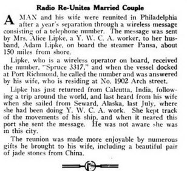

**ADAM WILLIAM LIPKE**, son of Frederick and Julia KOPATZ Lipka, was born in Buffalo, New York on November 20, 1893. His father was from Prussia and soon after coming to the United States his surname was chanted to Lipke. 

Adam married Alice Poole on December 29, 1916 in Alemada, California. 

Adam and Alice Lipke left Seattle by steamship for Alaska sometime and, upon arrival,  travelled by dogsled to their first posting, the village of McGrath in Alaska's interior. When McGrath was inundated by heavy flooding from adjacent rivers, they pulled stakes and moved to Seldovia in the early 1920s. Adam was a ham radio operator and established a telegraph office in Seldovia.  In 1947, after John Groothof had established a community telephone service, Adam installed a radio telephone transmitter which enabled Seldovians to speak directly with people in Anchorage for the first time. 

Alice started her own clothing store, Lipke's Clothing Store on Main Street next to her husband's telegraph office.  In 1938, Alice wrote "Under The Aurora", a book about her life in Alaska in the era of the 1920's - 1930's. While she and Adam are given fake names, most of the other characters and the events are true to her memory.

Adam and Alice divorced and he then married Tyndall MORGAN Caldwell on October 12, 1944 in Seldovia. Tydall took over ownership of Lipke's Clothing Store. 

Adam died in Seldovia on November 30, 1957 and is buried in the Seldovia City Cemetery in Plot #84.  
