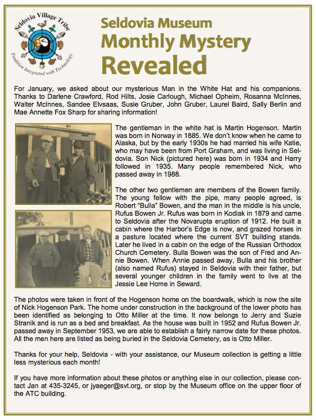

# Martin Haakonsen/Hogenson

**October 16,1884, Stavanger, Norway --August 1, 1964, Seldovia,
Alaska**

**Martin Hogenson** was born **Martinus Haagensen** in
Stavanger, Rogaland, Norway in 1885. His parents were Hartvig and Karen
Haagensen. In 1910 he was living in Bristol Bay. Martin married [**[Emma
Edlemann**](../Word_Documents/Andrew%20Matson%20and%20Edelman.docx)
in Kenai, Alaska, on August 3, 1919, when he was 34 years old. By 1930
he was widower, living alone in Seldovia. He then married **[Katie
Toko** who was from Port Graham. She had previously been
married to Bayou. Their son **Nick** was born in 1934 and
**Harry** followed in 1935. Martin Hogensen died in August
1964 in Seldovia, Alaska, when he was 79 years old. He is buried in the
Seldovia City Cemetery, Plot \#191, next to his son Nick.

The Hogenson home was on the old boardwalk, which is now the site of
Nick Hogenson Park.

# Nicholai "NICK" Hogenson

## August 20, 1934, Seldovia, Alaska -- June 30, 1988, Seldovia, Alaska

When ***Nick Hogenson*** was born in 1934 in Alaska, his
father, Martin, was 50 and his mother, Katie, was 36. He had one younger
brother, Harry (195-2013). He died on June 30, 1988, at the age of 54,
and was buried in Seldovia, Alaska.In August 1966, Nick Hogenson and 2
others were rescued from a wooden skiff after their 32-foot salmon
seiner, "Snug" swamped and sank about forty miles off the tip of the
Kenai Peninsula. The three were brought to Kodiak by a U.S. Coast Guard
helicopter. The skipper of the craft, Simon Josefson, said the boat sank
within two to three minutes after it began taking on water. He said he
just had time to radio a distress message and then all three went off in
the skiff. With them was also Josefson's 10 year old son John. From
Fairbanks Daily News Miner, August 15, 1966.

Nick is buried in the Seldovia City Cemetery, Plot \#190, next to his
father, Martin Hogenson.

{width="7.833333333333333in"
height="10.2in"}
