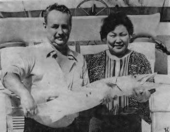
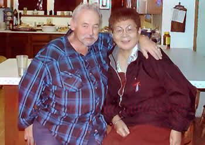

# Frederick Walter (Freddy) Newmeyer

 
  
**FREDERICK WALTER NEWMEYER, "FREDDY** was a leap year baby, born February 29, 1928 in San Francisco,
California, the only child weighing in at 13 pounds in his day. His
parents were Emma and Fredrick Walter Newmeyer. He graduated from high
school and shortly after graduation he joined the Army and learned to
cook and became an excellent baker. After his honorable discharge he took
up on an ad for a camp cook for Chisnik Canneries (Snug Harbor).

Freddy met his wife, Milly (Mildred KAGAK) in downtown Anchorage, and shortly thereafter they
married. 

 

He loved traveling the world and together they traveled it
twice; he especially loved Germany, France, Holland, Europe, Japan,
Thailand, and China. He also enjoyed fishing, boating, camping and took
the Alcan Highway passage many times with his motor home. 

Freddy was honored as Seldovia's Old Crab in 1999.

He loved cooking and baking and was the owner of Seldovia Lodge which he had operated since 1972, selling it in 1997. 

He and Milly later became snowbirds in Yuma AZ while still enjoying summers in Alaska. He
had studied the mythology of football and baseball, and won most of his
bets, which led him to win the Super Bowl when the Dallas Cowboys, his
favorite team won. Freddy and Milly were inseparable\! Friends say he
was always jolly and always happy\! His family wrote "Freddy's love of
cooking and travel will be an inspiration to others to live life to the
fullest wherever that will take you\! He leaves numerous family member
and friends. 

Freddy died at home on September 18, 2012, with his wife and sister-in-law by his side. Graveside services with military honors were held at Fort Richardson National Cemetery, Anchorage.

