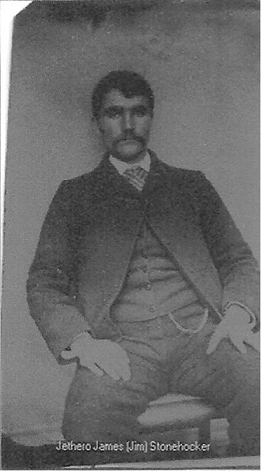

# James Jethro "Jim" Stonehocker

January 18, 1864, Montezuma, Iowa – May 10, 1939, Seldovia, Alaska

James Jethro "Jim" Stonehocker was born Jan. 18, 1864 in Montezuma, Iowa
to Perry and Sarah Sargood Stonehocker. By 1900 the family had moved to
Fulton, Missouri.

Jim married Ella Amanda Newland (1859-1949) in Fulton, Missouri on June
6, 1902. They were living in Missouri in 1910, but his family says that
James left for Alaska in 1919 and they never heard from him again.

He died May 10, 1939 in Seldovia, Alaska. He probably lived in a cabin
on the creek that bears his name, near China Poot Bay in Kachemak Bay.

