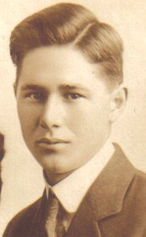

# Theodore "Ted" Nutbeem

May 2, 1894, Unalaska, Alaska -- November 28, 1944, Seldovia, Alaska

# Alice LARSEN Nutbeem

**September 15, 1899, Unga, Alaska -- July 13, 1990, Homer,
Alaska**{width="1.2819444444444446in"
height="1.8854166666666667in"}

**Theodore \"Ted" NUTBEEM** was the son of Albert and
Nadezda Nutbeem. His father was from England and his mother was Alaskan.
Ted\'s father died 17 Sept 1901, and after his mother also died he
entered the Jesse Lee Home in Unalaska, Alaska. Ted entered the
children\'s home June 1, 1898, when he was four years old, and lived
there attending school until he was 18 years of age.

**Alice LARSEN** was the daughter of Peter and Mary
(Hubley) Larsen. Her father was from Denmark and her mother was Alaskan.
Alice was raised in Unga Village, Unga Island, Shumagin Islands, Alaska
along with her six sisters and five brothers. She attended the Unga
Village school.
{width="1.2333333333333334in"
height="1.7145833333333333in"}

Peter Adolf Larsen was from Denmark, he left his Denmark home when he
was 12, becoming a sailor at sea. The 1900 US federal census for Unga
Village, Unga Island, Shumagin Islands, Alaska, record that Peter had
been in America for 25 years and that his home post office box was San
Francisco, California, where he was a sailor. Peter first came to Alaska
in 1886, and over the next several years he was a sea otter hunter, a
gold miner and then an employee of Unga Apollo Gold Mine.

Peter first married Tatiana Ivanovna Sorokovikov 9 Sept 1988 in Unga
Village. He and his wife lived at the Apollo Mine site. They had no
children. Peter married Mary Hubley 24 May 1893. They lived in Unga
Village and had 12 children: five sons, Peter II, James, Peter III,
Edmund and Norman; seven daughters, Zenia, Grace, Alice, Emily, Gladys,
Clara, and Elizabeth. Son Peter II died as an infant during an influenza
epidemic, daughter Emily died from severe burns at age 12. Peter became
a citizen of the United States in Unga on 11 Sept 1899. Mary was also a
village midwife.

In 1900, Peter left the mining business and began a career as a bear
hunter and guide, he became well known as a successful hunter helping
sportsmen bag over 70 bears. He scored many of the bears himself during
a hunting career that lasted more than 30 years, hunting on mainland
Alaska and Kodiak Island. One of the Larsen Bay\'s on Kodiak Island is
named in his honor. Peter also transplanted blue fox from the westward
Aleutian Islands onto Big Konuji Island in the Shumagin Islands, which
he leased from the federal government for fox farming.

Ted Nutbeem and Alice Larsen were married on February 12, 1920, in Unga
Village, Unga Island, Shumagin Islands, Alaska. They later moved to the
Kenai Peninsula where they homesteaded in Halibut Cove before moving to
Seldovia to make it a permanent home. Ted and his wife Alice held the
positions of cook and baker on ships that traveled the Alaska coast from
southcentral Alaska to the Aleutian Islands. Later Ted worked as a baker
in Seldovia. Ted and his wife Alice had no children. After Ted's death
Alice continued to live in Seldovia the rest of her life, traveling only
to visit her Alaska and Washington State family.

Laurel Baird speaking to Jan Yaeger on Project Jukebox October 10, 2014:

JAN YAEGER: You mentioned your godmother was Alice Nutbeem. Can you talk
about her a little bit?

LAUREL BAIRD: Oh, she was wonderful. She was this little lady that \--
she just adored her husband Ted, and they have a wonderful story, too.

She's from Unga. Ted was in the Jessie Lee home, and then they got
married. And then he got very ill with cancer and passed away and is
buried here in the Seldovia cemetery.

And she was just loyal, keeping his grave always clean, and she just
adored him. Before that they had a restaurant called Ted's Café here?
And I guess he was a wonderful cook and so she learned all about that
business.

And so she was always in the food area. She worked in the cannery in the
summertime. She worked at Libby \-- Libby's Cannery up in Kenai, and we
always missed her when she'd leave in the spring to go up there, and she
worked in the cookhouse.

And then after Libby's closed she came here and worked in the cookhouse
at the AYR cannery. But she would come to the house every morning and
have coffee with my family, and then she'd come in the afternoon
whenever Mom needed somebody to watch us kids, she watched us for long
periods of time.

And because Mom had a lot of kids and she was busy, Alice really taught
us so many, many skills, like, she was there on our first day when we
went off to school.

She taught us how to stitch, and she was very particular about her
stitching. So she made us do beautiful handwork.

And then she's our godmother, because she insisted that we be baptized
in the Methodist church, so we were baptized when we were older.

And Alice was \-- knew both my mom and dad from the Chignik area, from
being on the \-- whether it was the steamer \"Dora\" they talked about,
or the \"Old Star,\" they all had gone the same pathways and \-- with
the fishing industry and the mining industry in \-- out in Unga.

So she had a lot of great stories to tell. And she was a wonderful,
loving person and a very dear friend of my mom's.

Alice lived up the slough, and she had \-- her \-- the original house
that her and Ted built was a tent. So it was one of those white canvas
tents.

And then they just added wood around it, and so it really wasn't
insulated, because when the wind blows, it would \-- inside, you could
see the tent moving. But it was warm and cozy in there. There was a
great little enamel stove.

And it didn't have a bathroom, and then it had one little area that was
like the bedroom. And we loved being able to stay over there because she
had \--

When she was sixteen years old, she got this featherbed that was made
out of feathers from Unga, and she would fluff that featherbed up and
then she'd let us come and spend the night. And we got to sleep in the
featherbed and always loved that.

And then she had this little table by the one window in her house, and
it looked out over the slough. And it had \-- we still today \-- my
sister and I talk about it. We liked just the little table with a window
like that and a little old-fashioned radio with a dial on it. We both
know exactly what that radio looked like and the alarm clock next to it.

And we'd sit there and have coffee at her house with her and just loved
bein' up there. And to this day, Loretta and I always talk about goin'
to Alice's and being able to spend time there.

Eventually, she got a bathroom in her home. That was nice \-- nice for
her. But she loved to garden, and she'd just bring in soil because she
didn't have the best soil up there. So she'd bring it in, and she'd work
it, and put fertilizer in it.

There was a dairy farm up the slough, and so she would bring manure and
stuff and enrich the garden.

And she grew wonderful things. She had big bunches of petrushkies in her
garden \-- we put on our fish. For seasoning it was wonderful.

And she'd always bring us goosetongues in the spring, when the
goosetongues first came out. And she \-- we would go to the beach and
get bidarkis, and we got goosetongues out by the beach, too.
