Prior to  the 2008 sewer and water project, the only Seldovia properties listed in the Alaska Heritage Resource Survey or AHRS - the state-wide inventory of archaeological and historic architecture properties maintained by the Alaska Office of History and Archaeology, were the town of Seldovia itself (SEL-084) and the Russian Orthodox Church (SEL-023.  Susan Springer, in her book "Seldovia, Alaska - An Historical Portrait of Life in Herring Bay" created a list of old buildings in Seldovia, along with short descriptions of their history. To provide additional context for the archaeological monitoring effort an assist in tracking Seldovia's historic buildings, AHRS numbers were obtained for those buildings as well as two others.  The inventory is not necessarily complete, and there are likely other old buildings in Seldovia that deserve to be added.

SEL-023 [**Russian Orthodox Church**](st-nicholas-church.md)  

SEL-331 **Seldovia Bible Chapel**  

SEL-332 **Ralph and Juanita Anderson Home** built by Baishoff brothers from Kenai  
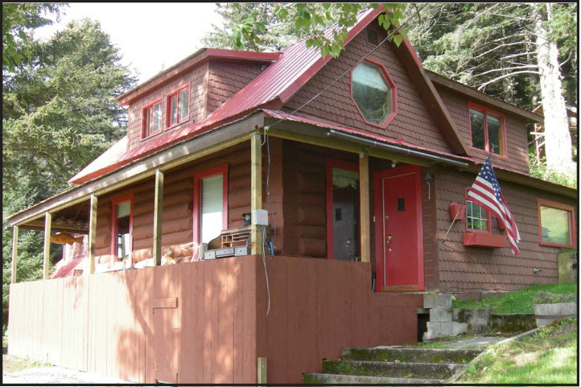

SEL-333 **Gruber Home** "was originally the cook shack at the chrome mine on Chrome Bay in Port Chatham"  
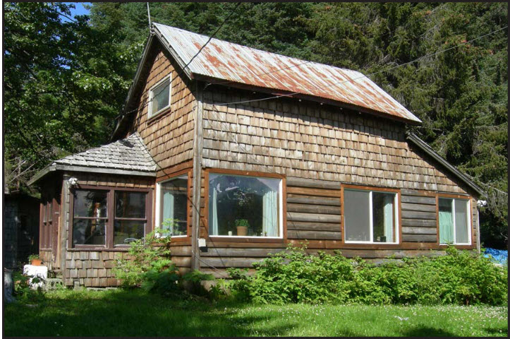

SEL-334 **Jack English Office**  
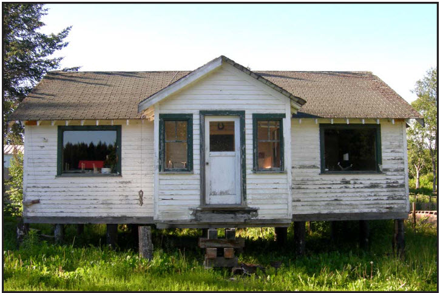

SEL-335 **Hospital**  
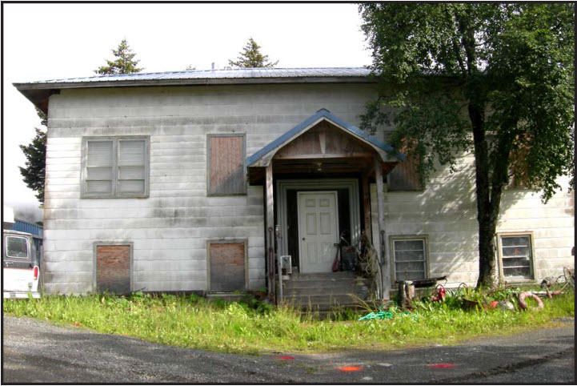

SEL-336 **Winfree Home**  

SEL-337 **Walter Liponcott Home** built in 1930s for fisherman Walter Liponcott; on boardwalk extending into Seldovia Slough  
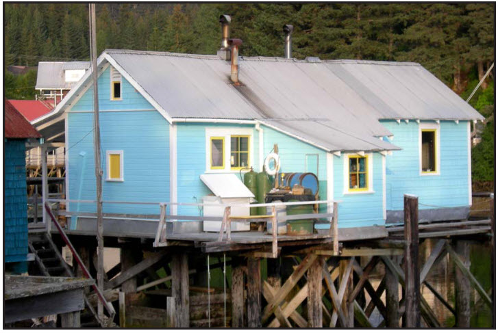

SEL-338 **Ed Feldahl Home** built in 1930s; now Dancing Eales Bed & Breakfast  
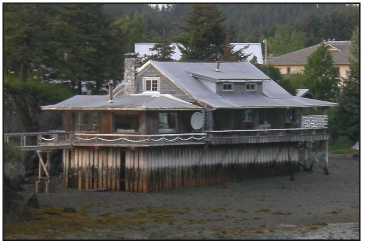

SEL-339 **Josefson Home** located on south side of Seldovia Slough was built around 1917 and was the home of [**Simon and Emma Josefson**](../_people/Josefsen_Simon_F.md). Traditionally it was painted robin's egg blue, and current owners have maintained that.  
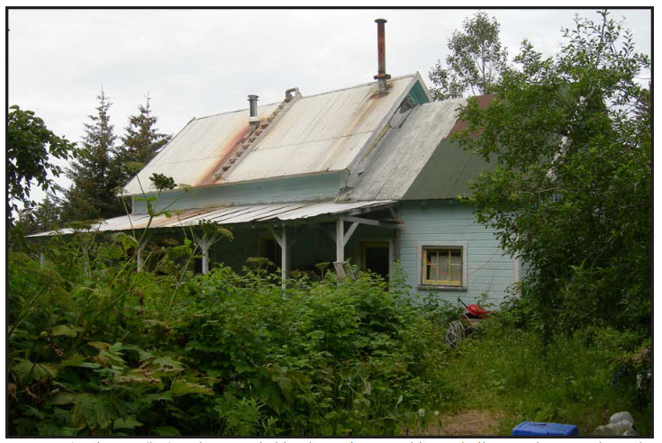

SEL-340 **Hilmer Olsen Home** built in the early 1930s by [**Hilmer Olsen**](../_people/Olsen_Hilmar.md)  
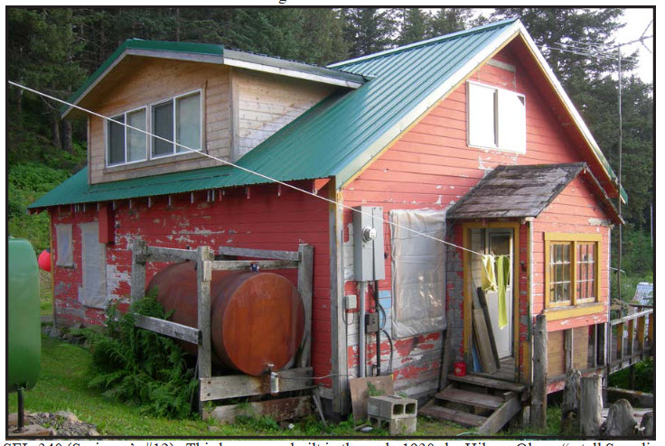

SEL-341 **Ed Seaverson Home** built prior to 1938 for Scandinavian fisherman Ed Seaverson.  
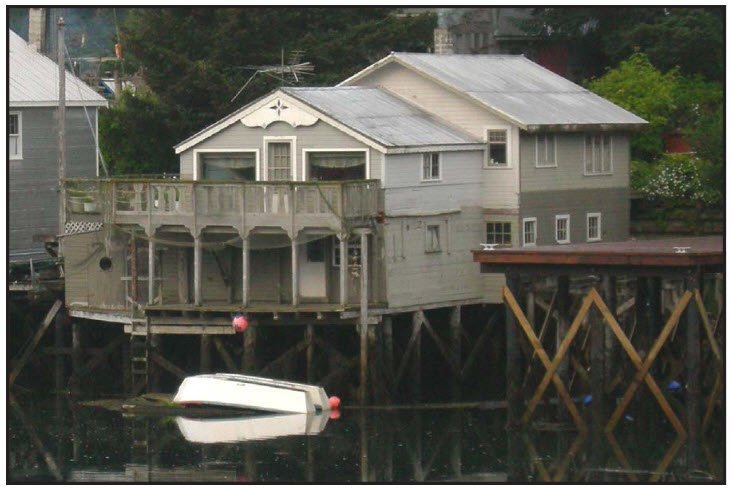

SEL-342 **Jack Wormensen Home** built in 1930s for the Scandinavian fisherman who fished in Bristol Bay and Cook Inlet and trapped beaver and marten in the winter.  
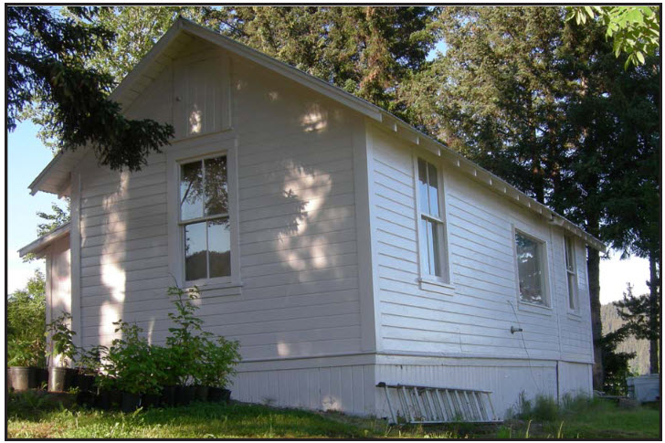

SEL-343 **Marshal Andy Anderson Home** built in 1930s. "Andy's wife, Inga, was very short and much of the house was scaled down to accommodate her."  
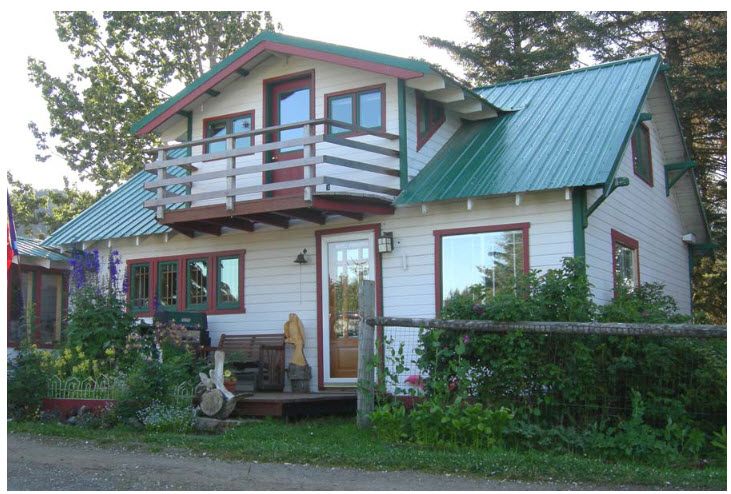

SEL-344 **Martha Jensen Home** built by Paul Petresun  
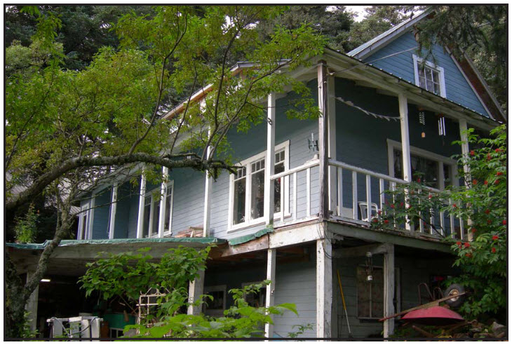

SEL-345 **Bessie Lloyd House** built in the 1940s  
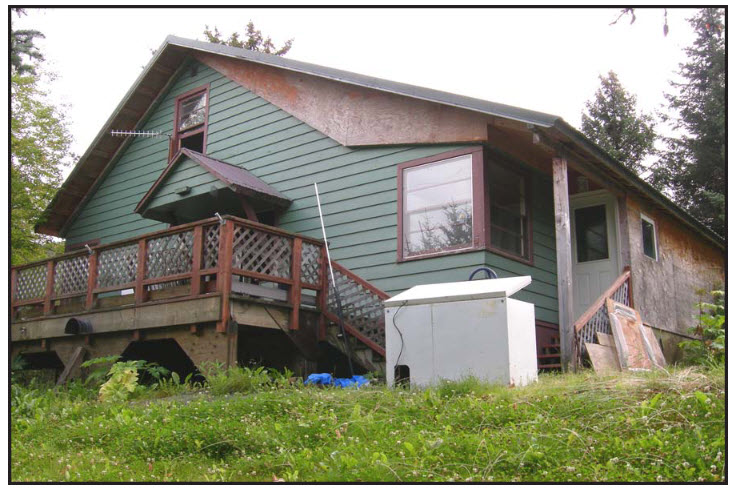

SEL-346 **Typical Boardwalk Building**  
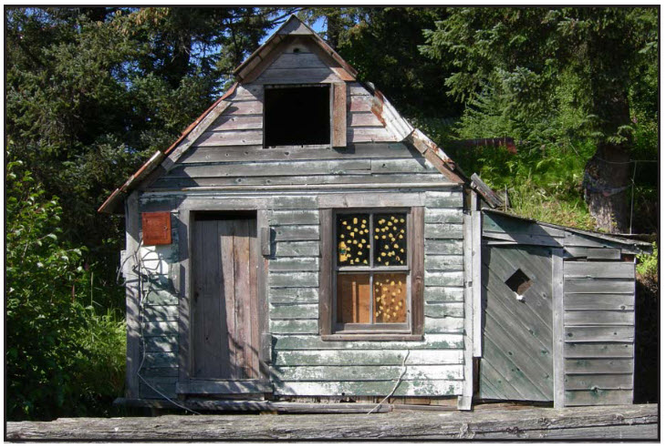

SEL-347 **Pre-1964 House** on Seldovia Slough next to SEL-337  
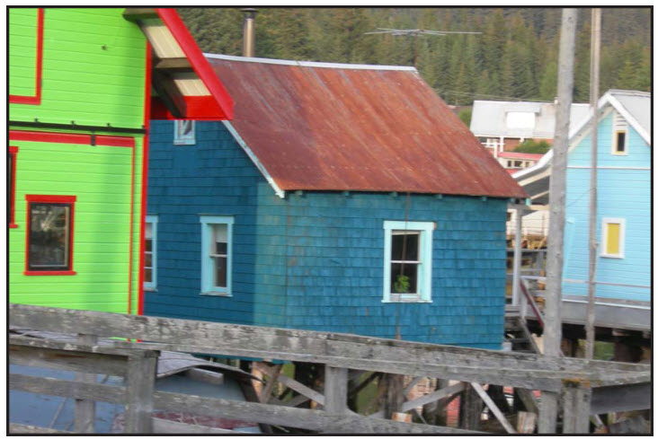

