The centerpiece of the Seldovia landscape, after its natural scenic beauty, has almost always been the St. Nicholas Chapel, commonly known as the Russian Orthodox Church. Built about 1890- 1891, and replacing an earlier log church down near the beach, it is truly an iconic landmark! 

Many people are surprised to learn that it was the native Alaskan people who were the catalyst for the building of the church, wnich was dedicated to St Nicholas.* There were few Russians here by that time. Alaska had been under United States control since it purchased Alaska from Russia in “Seward’s Folly” on March 30, 1867.  But the Russian Orthodox faith, which can be traced back at least to the 1880's in Seldovia, was still a central part of community life here in the early 20th century. 

The church was built in the design typical of other small churches of the Russian Orthodox faith: a simple white frame rectangular building featuring a bell tower with an octagonal, partly open belfry; the tower is topped by a tall cross. The church has a gable roof with a four-sided cupola in the middle, which is topped by another cross.  The bell tower, installed in 1906, is topped by the traditional shape termed the “flame”. In the case of St. Nicholas, the flame, often called the “onion” is slender and flame-like ; it has been likened to a tongue of fire, crowned by a cross and tapering towards a cross.  When the piece came loose during the past century, someone replaced it upside-down: such was the church’s dilapidated condition that no one bothered to protest. 
The chapel was added to the National Register of Historic Places in 1980.

*Saint Nicholas, the Wonder Worker, was a Greek bishop in Asia Minor in the 4th Century. He was famous for his kindness to children and would later inspire the legend of Santa Claus. He is the patron saint of children, sailors, and of prisoners who've been wrongly condemned.

## [Restoration, 1980-1981](http://www.combsandcombsaia.com/st.-nicholas-russian-orthodox-church-restoration--seldovia--alaska--1980-1981..html)   

A building restoration project was originated by architect Sam Combs when he observed the church in such poor condition that
it was about ready to fall down. He contacted the President of the Senate at that time, Clem Tillion,
who obtained the funds from the State legislature. The project was completed in less than a year and
now once again the church is a proud reminder of Seldovia's historic past.

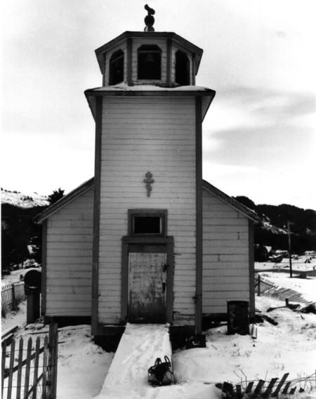
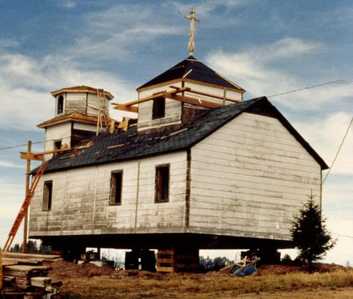
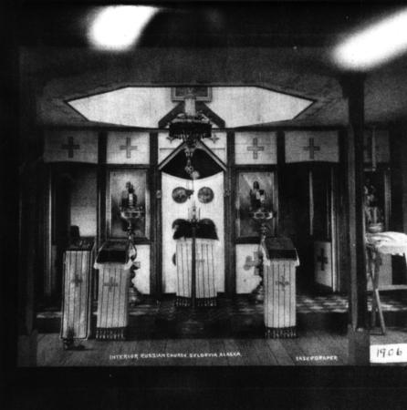
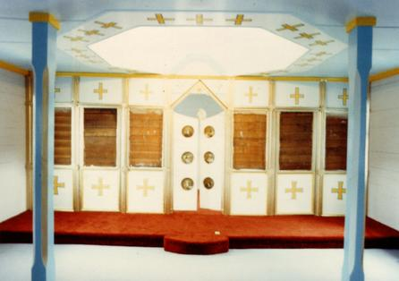

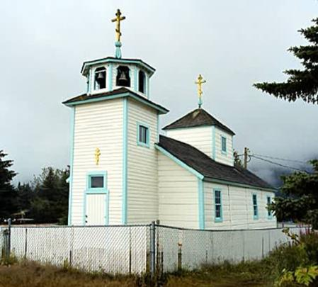
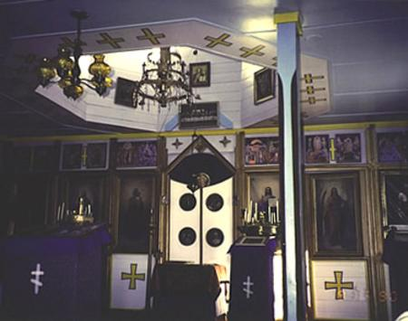
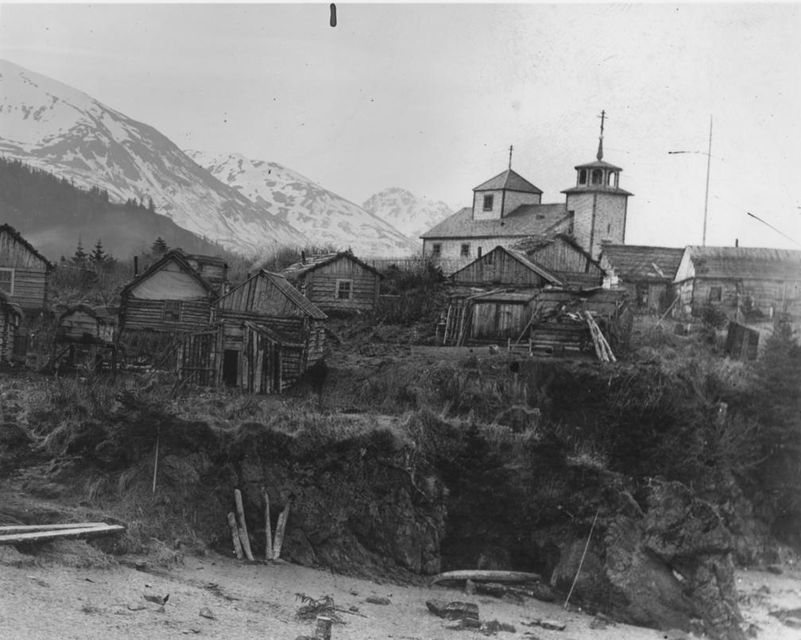
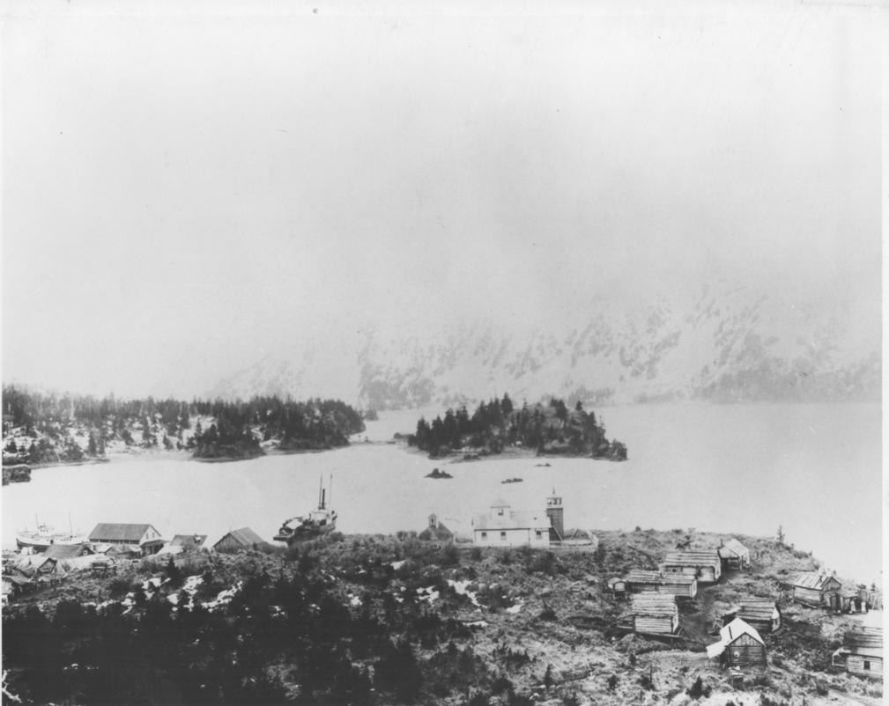
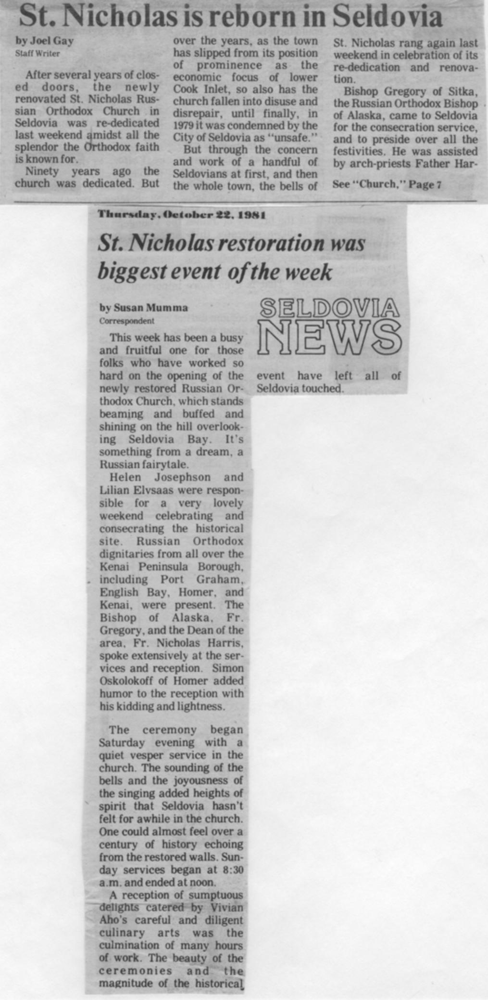
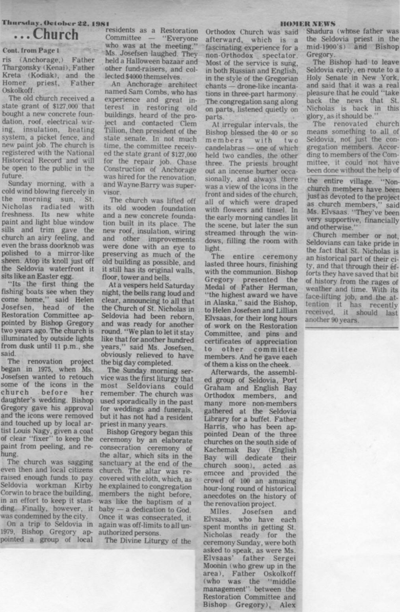
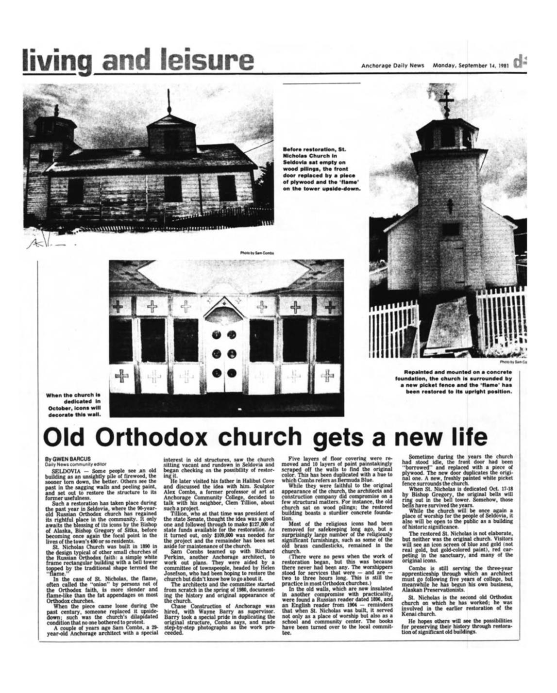
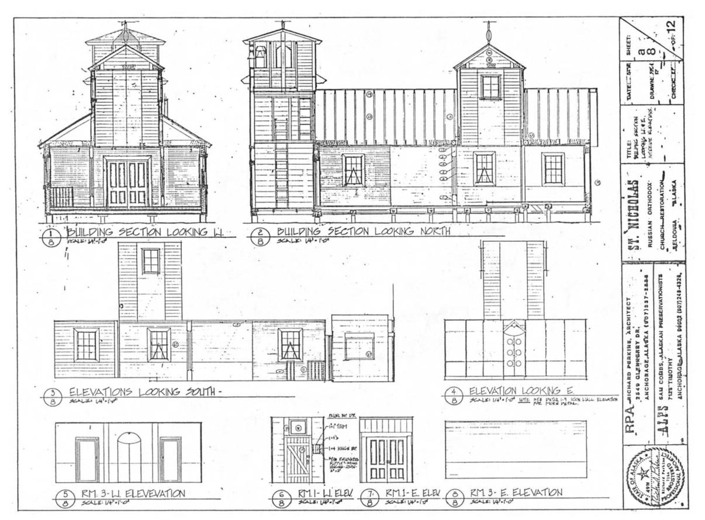
